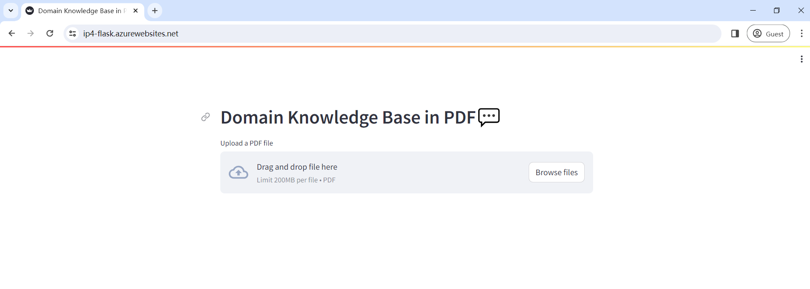
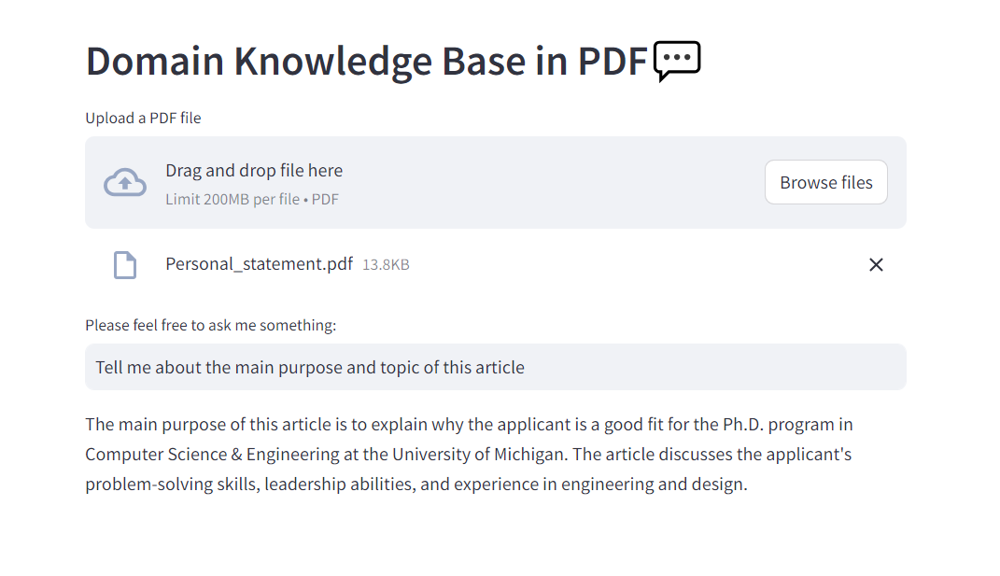
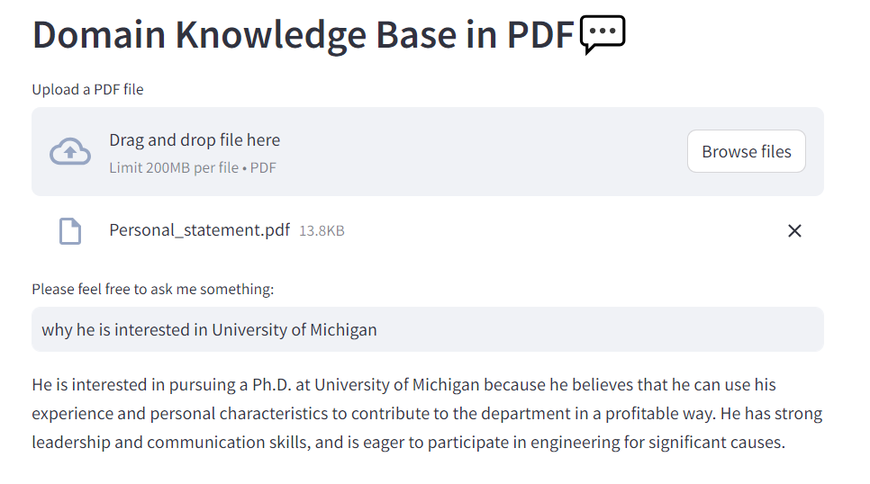
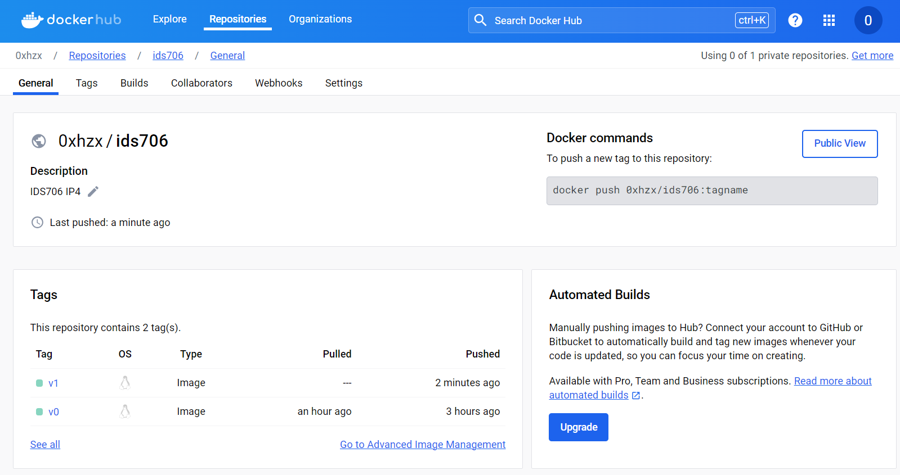
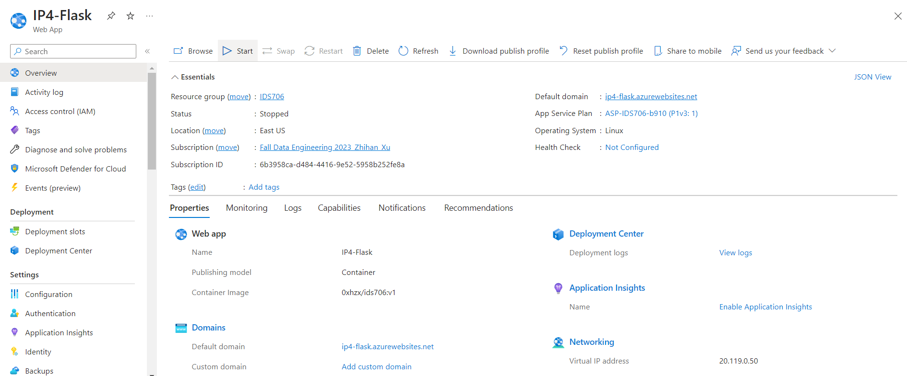

[](https://github.com/nogibjj/python-ruff-template/actions/workflows/cicd.yml)

# IDS706 Individual Project 4: Auto Scaling Flask App Using Any Platform As a Service

## Requirements
For this assignment, you will build a publicly accessible auto-scaling container using Azure App Services and Flask. This is an easy way to build and deploy a scaleable web-hosted app and will allow you to apply your Flask knowledge from previous lessons.

## Overview
LangChain ChatGPT PDF Knowledge Base is a project that aims to build a knowledge base using ChatGPT and PDF documents. It allows users to interact with a language model powered by ChatGPT to ask questions and receive answers based on the information contained in PDF documents.

## Architecture
The LangChain ChatGPT PDF Knowledge Base project consists of the following components:

- ChatGPT language model: A pre-trained ChatGPT model that provides conversational capabilities.
- PDF document parser: A component responsible for parsing PDF documents and extracting text content from them.
- User interface: A user-friendly interface that allows users to interact with the system and receive answers to their queries.

## Key features
1. Flask Web App Functionality:
- Ingestion: PDF documents from users are uploaded to the system and processed by the PDF document parser. Text content is extracted from the documents and stored in the information retrieval system's index.
- Conversation: Users can initiate a conversation with the system by asking questions or providing queries. The ChatGPT language model handles the conversational interaction.
- Query processing: When a user submits a query, the system processes the query and retrieves relevant information from the information retrieval system based on the extracted text content.
- Answer generation: The retrieved information is used to generate an answer to the user's query. The GPT-3.5 model can also provide clarifications or ask for additional context if needed.
- Response: The system presents the generated answer to the user through the user interface. The conversation context is maintained to handle follow-up questions or continued interaction.

### Screenshots for explaining the web app
- Upload the PDF file


- Start asking and receive specific information




2. Docker Containerization: Using Docker to encapsulate the app's code and dependencies, simplifying deployment across different environments.

## Use of DockerHub
The project provides a Docker image that contains all the necessary components and dependencies to run.

### Prepare a Dockerfile
```Dockerfile
# app/Dockerfile
FROM python:3.8

WORKDIR /app

COPY . .

RUN pip3 install -r requirements.txt

EXPOSE 5000

RUN echo 'python service/app.py &' >> /entrypoint.sh && \
    echo 'streamlit run service/langchain_PDF.py --server.port=5000 --server.address=0.0.0.0' >> /entrypoint.sh && \
    chmod +x /entrypoint.sh

ENTRYPOINT ["/bin/bash", "/entrypoint.sh"]

```
### Build the image and push to your own repo
```Dockerfile
docker build -t ids706:latest . 
docker login
docker tag ids706:latest 0xhzx/ids706:latest
docker push 0xhzx/ids706:latest
```



## Depolyment on Azure Web App
- Set specific image from Dockerhub: First, we should go to the section "Deployment Center". Choose the option to deploy a container from Dockerhub.
- Azure Configuration: We should set environment variable `WEBSITES_PORT`, which is used to specify the port number on which your application should listen. When you deploy your application to Azure App Service and configure the port number using this environment variable, Azure App Service will forward traffic to the specified port. When you access a website on Azure App Service, it's typically accessed using HTTP (port 80) or HTTPS (port 443). However, if your application listens on a port number different from the default ports, such as 5000, within a Docker container, you need to inform Azure App Service to forward traffic to that specific port by setting the `WEBSITES_PORT` environment variable.




## Conclusion
The LangChain ChatGPT PDF Knowledge Base project combines the power of ChatGPT with PDF document processing to create an interactive and intelligent system for knowledge retrieval. By leveraging natural language queries and document extraction techniques, users can easily access information from PDF documents in a conversational manner. This project opens up possibilities for building sophisticated conversational agents that can assist users in various domains requiring PDF document knowledge access.


